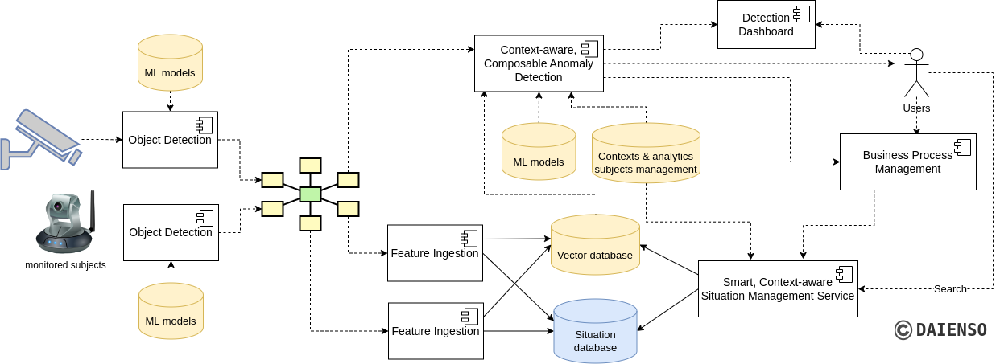

# Fansipan - Fast Analytics aNd Situational Intelligence Platform for Anomaly resolutioN
A collection of tools and pipelines for object detection, anomaly detection, situation analytics, including search features in a holistic manner. It includes end-to-end stream-processing pipelines with state-of-the-art techniques, analytics, and ML models to serve various purposes in various application domains.
## Intro
A Joint Development between [Gigarion](https://gigarion.com/) and [Daienso Lab](https://www.daienso.com/)

## High-level View

Fansipan focuses on anomaly detection and situation reactions based on detected results from video/audio/sensor sources combined with contexts from domains and operations, using powerful and customized messaging systems suitable for different customer settings (such as gRPC, MQTT, Pulsar, Kafka, and AMQP) for real-time scenarios.

### Object Detection subsystem
Using state-of-the-art detection models (PyTorch, Ultralytics YOLOv*, etc.), which are well-trained with data collected for specific domains.

### Feature Ingestion subsystem, Vector Database, and Situation Database
Our focuses are on (1) extracting situations from the detected objects for the Situation Management Service and (2) modeling the output of Object Detection subsystem and situation extraction in the right structure for further analytics, ML, and automation. Fansipan brings our research on holistic analytics for modeling extracted data, domain analytics subjects and based on our extensible knowhow [1] in telcos domains.

### Context-aware, Composable Anomaly Detection subsystem
Fansipan includes our research novelties – the Daienso Anomaly Detection framework [2], where context-awareness in end-to-end detection and the composability of algorithms and contexts are the keys. Contexts are used to understand the operation's needs, capture relevant data and analytics requirements, and access the relevance and importance of domain knowledge.

### Smart, Context-aware Situation Management Service
The service has a wide range of applications in smart security monitoring, predictive maintenance, water management, surface/structure defect surveying.

### Business Process Management
Integrates the solutions with customer’s business processes and automated workflows as well as incident management systems.

## References
[1] H. -L. Truong and N. Ngoc Nhu Trang, "HAIVAN: a Holistic ML Analytics Infrastructure for a Variety of Radio Access Networks," 2022 IEEE International Conference on Big Data (Big Data), Osaka, Japan, 2022, pp. 2389-2393, doi: 10.1109/BigData55660.2022.10020515. [PDF Paper](https://acris.aalto.fi/ws/portalfiles/portal/91823963/main.pdf)

[2] N. N. N. Trang and H. -L. Truong, "Context-aware, Composable Anomaly Detection in Large-scale Mobile Networks," 2023 IEEE 47th Annual Computers, Software, and Applications Conference (COMPSAC), Torino, Italy, 2023, pp. 183-192, doi: 10.1109/COMPSAC57700.2023.00032. [PDF Paper](https://acris.aalto.fi/ws/portalfiles/portal/108507769/main.pdf)