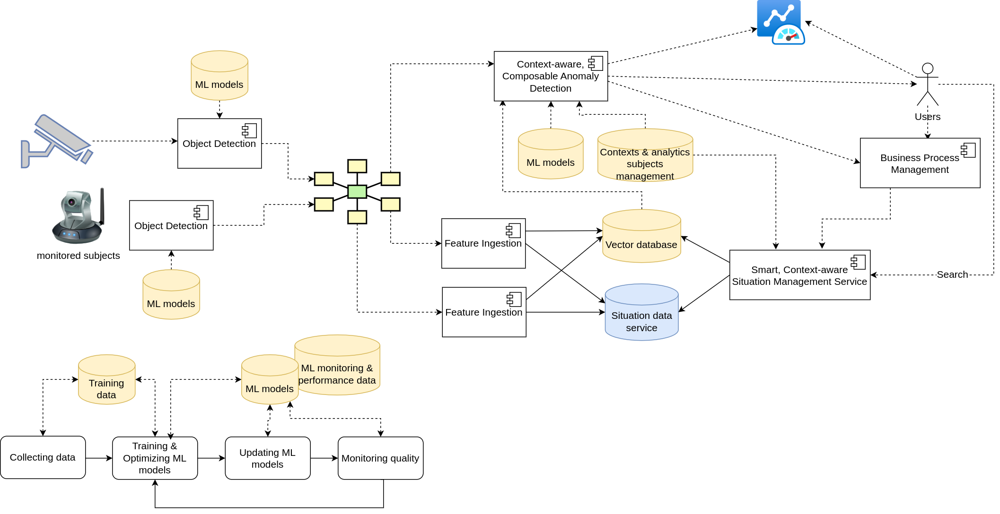

# Fansipan -
A collection of tools and pipelines for object detection, anomaly detection, situation analytics, including search features in a holistic manner. It includes end-to-end stream-processing pipelines with state-of-the-art techniques, analytics, and ML models to serve various purposes in various application domains.
## Intro
A Joint Development between [Gigarion](https://gigarion.com/) and [Daienso Lab](https://www.daienso.com/)

## High-level View

Fansipan focuses on anomaly detection and situation reactions based on detected results from video/audio/sensor sources combined with contexts from domains and operations, using powerful and customized messaging systems suitable for different customer settings (such as gRPC, MQTT, Pulsar, Kafka, and AMQP) for real-time scenarios.

### Object Detection subsystem
Using state-of-the-art detection models (PyTorch, Ultralytics YOLOv*, etc.), which are well-trained with data collected for specific domains.

### Feature Ingestion subsystem, Vector Database, and Situation Database
Our focuses are on (1) extracting situations from the detected objects for the Situation Management Service and (2) modeling the output of Object Detection subsystem and situation extraction in the right structure for further analytics, ML, and automation.

### Context-aware, Composable Anomaly Detection subsystem
Contexts are used to understand the operation's needs, capture relevant data and analytics requirements, and access the relevance and importance of domain knowledge.

### Smart, Context-aware Situation Management Service
The service has a wide range of applications in smart security monitoring, predictive maintenance, water management, surface/structure defect surveying.

### Business Process Management
Integrates the solutions with customer’s business processes and automated workflows as well as incident management systems.